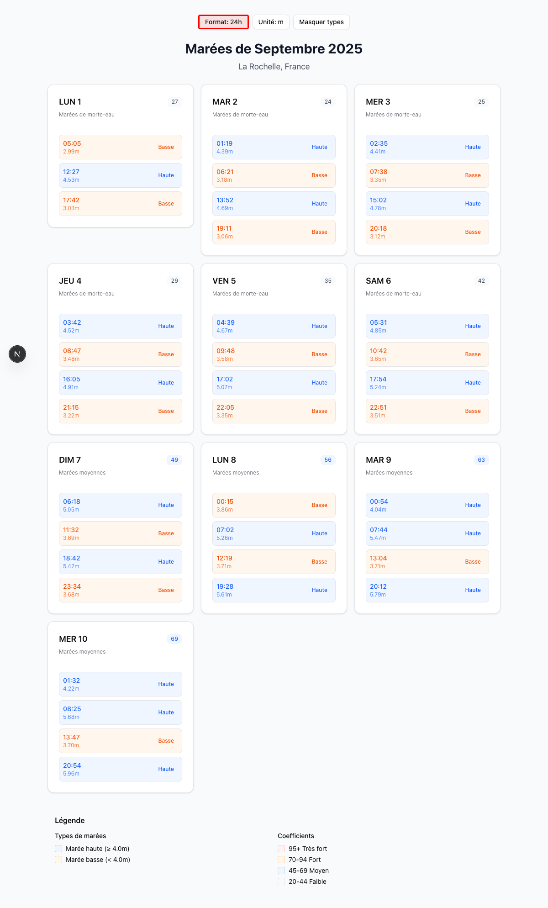
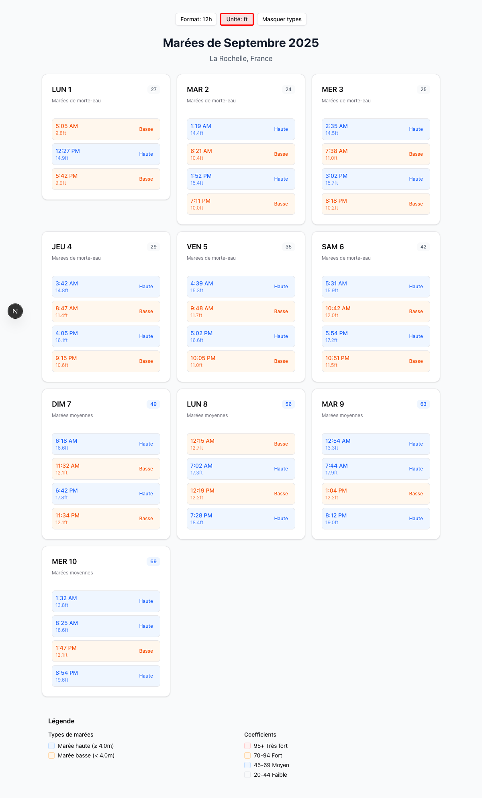
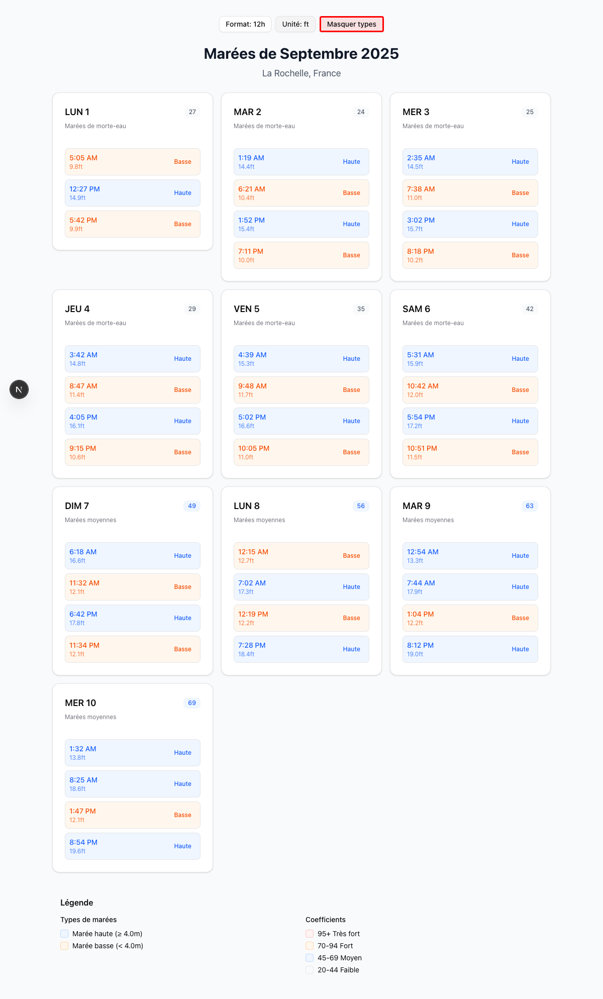
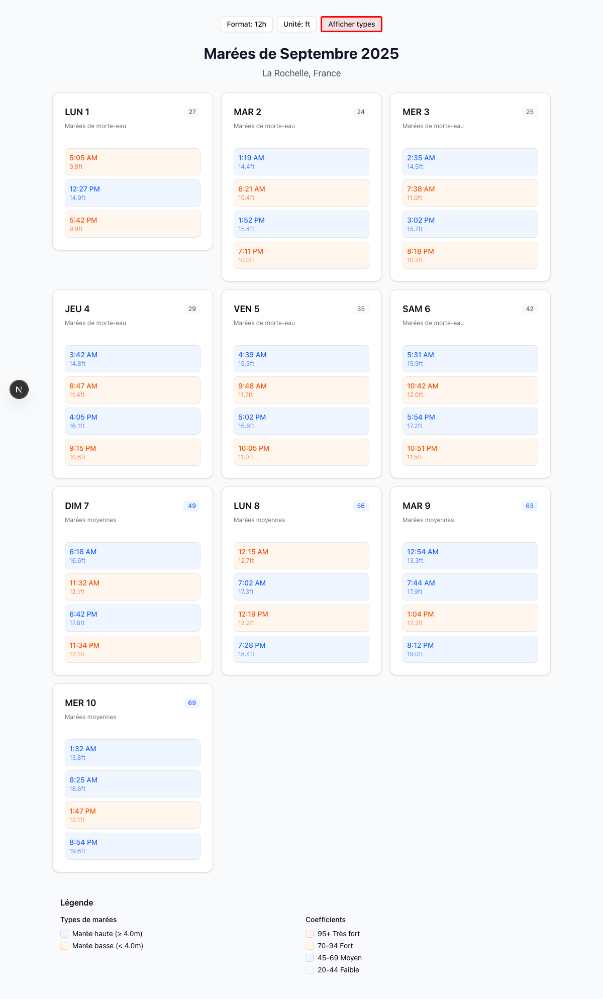
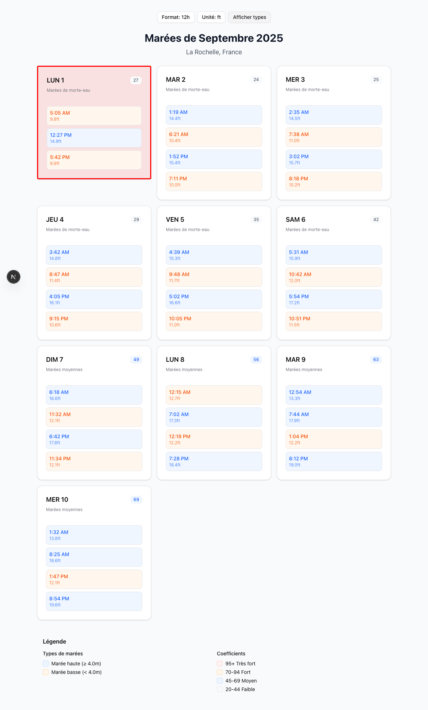

# Visualiseur de Marées - Guide Utilisateur

Bienvenue dans l'application Visualiseur de Marées pour La Rochelle, France ! Ce guide complet vous présente toutes les fonctionnalités de l'application.

## Aperçu

Le Visualiseur de Marées affiche les informations de marées pour La Rochelle, montrant les horaires quotidiens, les coefficients et les informations de timing détaillées. L'application fournit une interface intuitive avec diverses options de personnalisation.

## Fonctionnalités Principales

### 1. En-tête de l'Application

Le haut de l'application affiche :
- **Titre** : "Marées La Rochelle - Horaires et Coefficients"
- **Localisation** : "La Rochelle, France"
- **Mois et Année** : Actuellement "Marées de Septembre 2025"

### 2. Boutons de Contrôle

L'application inclut trois boutons de contrôle en haut pour personnaliser l'affichage :

#### Basculement du Format d'Heure

Le bouton **Format** (mis en évidence avec un contour rouge ci-dessus) vous permet de basculer entre les formats d'heure 24h et 12h :

- **Format 24h** : Heures affichées comme "05:05", "12:27", "17:42"
- **Format 12h** : Heures affichées comme "5:05 AM", "12:27 PM", "5:42 PM"

Cliquez sur le bouton pour basculer entre les formats. Quand le format 12h est actif, le bouton affiche "Format: 12h" :

#### Basculement de l'Unité de Mesure

Le bouton **Unité** (mis en évidence avec un contour rouge ci-dessus) bascule entre les unités de mesure métriques et impériales :

- **Mètres (m)** : Unités métriques par défaut - "2,99m", "4,53m"
- **Pieds (ft)** : Unités impériales - "9,8ft", "14,9ft"

Quand les unités en pieds sont actives, toutes les mesures sont converties et le bouton affiche "Unité: ft" :

#### Basculement d'Affichage des Types de Marée

Le bouton **Masquer types** (mis en évidence avec un contour rouge ci-dessus) contrôle si les étiquettes de type de marée sont affichées :

- **Types affichés** : Chaque heure de marée inclut les étiquettes "Haute" ou "Basse"
- **Types masqués** : Seules les heures et hauteurs sont affichées, rendant l'affichage plus compact

Quand les types sont masqués, le bouton change pour "Afficher types" :

### 3. Cartes de Marées Quotidiennes

Chaque jour est affiché comme une carte interactive contenant :

#### En-tête de Carte
- **Abréviation du jour et date** : "LUN 1" (Lundi 1er)
- **Coefficient de marée** : Grand nombre indiquant la force de la marée (ex: "27")
- **Catégorie de marée** : "Marées de morte-eau" ou "Marées moyennes"

#### Heures et Hauteurs de Marée
Chaque carte montre jusqu'à 4 événements de marée pour la journée, affichant :
- **Heure** : Quand la marée se produit
- **Hauteur** : Niveau d'eau en mètres ou pieds
- **Type** : "Haute" (Marée haute) ou "Basse" (Marée basse) - quand activé

#### Sélection Interactive

Les cartes de jour de marée sont cliquables (mises en évidence avec un contour rouge ci-dessus). Quand vous cliquez sur une carte de jour :

1. La carte devient sélectionnée et mise en évidence
2. La sélection est enregistrée dans la console du navigateur
3. La carte maintient un état "actif" pour un retour visuel

### 4. Section Légende

En bas de l'application, vous trouverez une légende complète expliquant :

#### Types de Marées
- **Marée haute (≥ 4,0m)** : Événements de marée haute avec un niveau d'eau de 4,0 mètres ou plus
- **Marée basse (< 4,0m)** : Événements de marée basse avec un niveau d'eau inférieur à 4,0 mètres

#### Coefficients de Marée
Le coefficient indique la force de la marée :
- **95+ Très fort** : Marées très fortes (coefficient 95 et plus)
- **70-94 Fort** : Marées fortes (coefficient 70-94)
- **45-69 Moyen** : Marées moyennes (coefficient 45-69)
- **20-44 Faible** : Marées faibles (coefficient 20-44)

## Comment Utiliser l'Application

### Visualiser les Marées Quotidiennes
1. Faites défiler la vue mensuelle pour voir tous les jours disponibles
2. Chaque carte montre l'horaire complet des marées pour ce jour
3. Notez le coefficient pour comprendre la force de la marée
4. Utilisez la catégorie de marée pour comprendre le modèle général

### Personnaliser l'Affichage
1. **Changer le format d'heure** : Cliquez sur le bouton "Format" pour basculer entre l'affichage 24h et 12h
2. **Changer les unités** : Cliquez sur le bouton "Unité" pour basculer entre mètres et pieds
3. **Simplifier l'affichage** : Cliquez sur "Masquer types" pour masquer les étiquettes de type de marée pour une vue plus claire

### Sélectionner un Jour Spécifique
1. Trouvez le jour qui vous intéresse
2. Cliquez sur la carte de jour pour la sélectionner
3. Le jour sélectionné sera mis en évidence et enregistré pour un traitement ultérieur

## Comprendre les Informations de Marées

### Modèles de Marées
- **Morte-eau** : Marées plus faibles avec de plus petites différences entre haute et basse mer
- **Moyennes** : Force de marée modérée
- **Vive-eau** : Marées plus fortes avec de plus grandes différences (coefficients plus élevés)

### Lire les Heures de Marée
- Les marées se produisent généralement 2 à 4 fois par jour
- Les heures sont affichées par ordre chronologique tout au long de la journée
- Les hauteurs indiquent le niveau d'eau au-dessus du zéro hydrographique

### Signification du Coefficient
- Des coefficients plus élevés signifient des marées plus fortes
- Utile pour planifier des activités comme la navigation, la pêche ou les visites de plage
- Important pour les considérations de navigation et de sécurité

## Notes Techniques

- L'application est responsive et fonctionne sur ordinateur et mobile
- Toutes les interactions sont immédiates et ne nécessitent pas de rechargement de page
- Les formats d'heure respectent votre préférence pendant la session
- Les préférences d'unité sont maintenues lors de l'utilisation de l'application

## Dépannage

Si vous rencontrez des problèmes :
1. Actualisez la page pour recharger les données de marée
2. Vérifiez que votre navigateur prend en charge les fonctionnalités JavaScript modernes
3. Assurez-vous d'avoir une connexion Internet stable pour la meilleure expérience

---

*Cette application fournit des informations de marées pour La Rochelle, France. Consultez toujours les sources maritimes officielles pour les applications de navigation et critiques pour la sécurité.*
