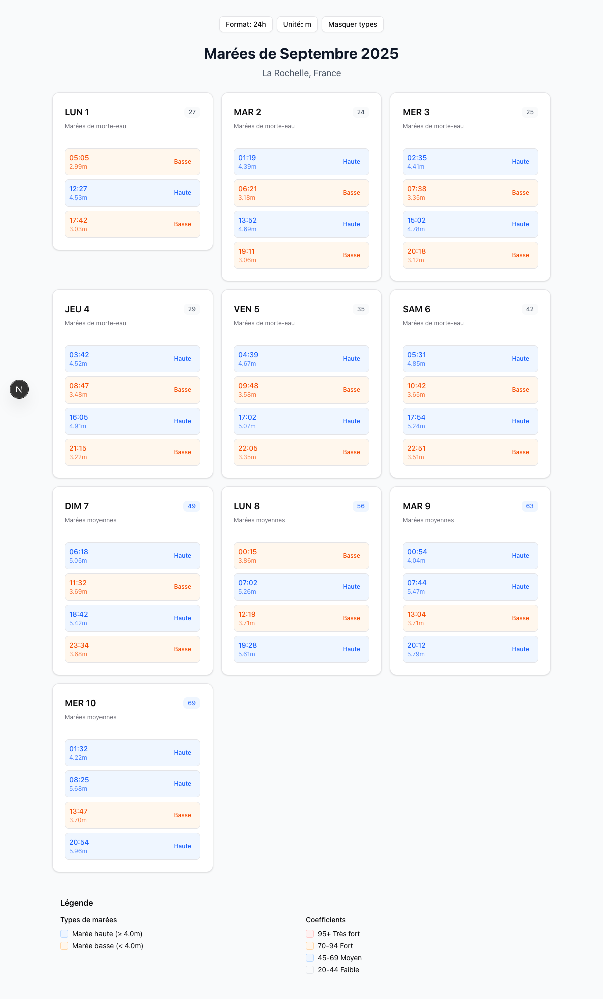
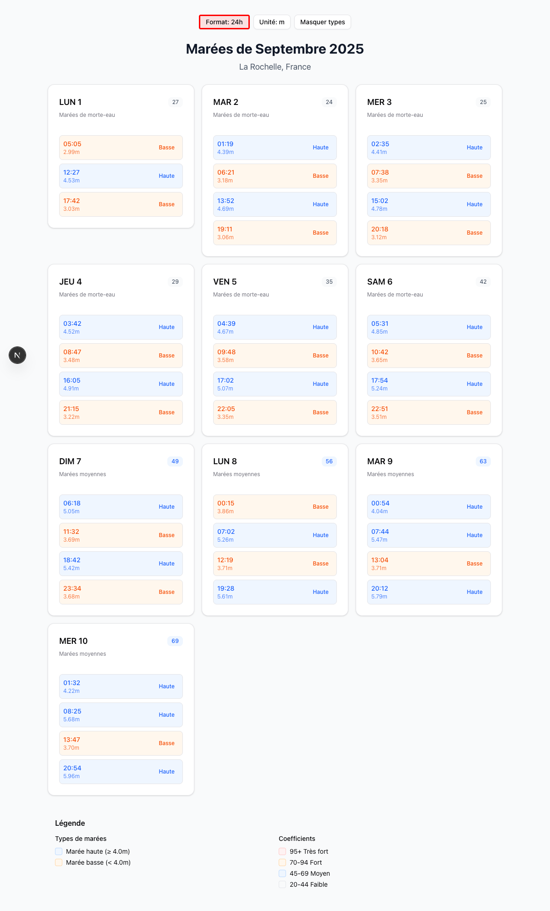
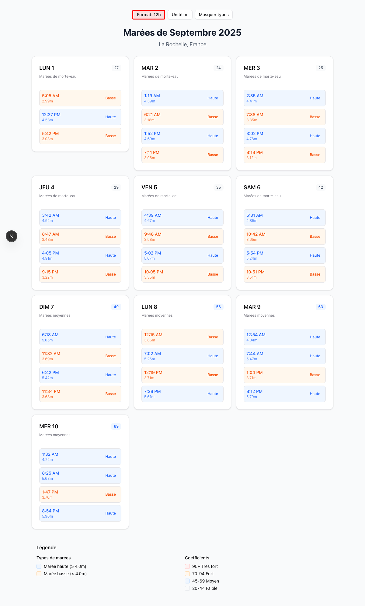
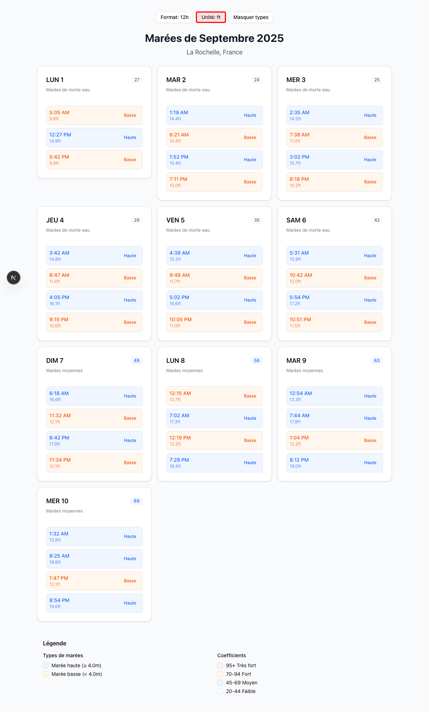
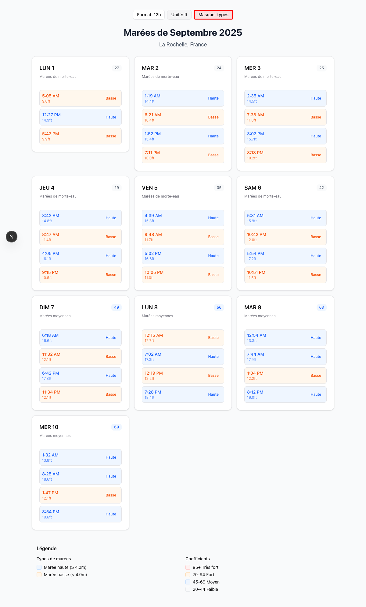
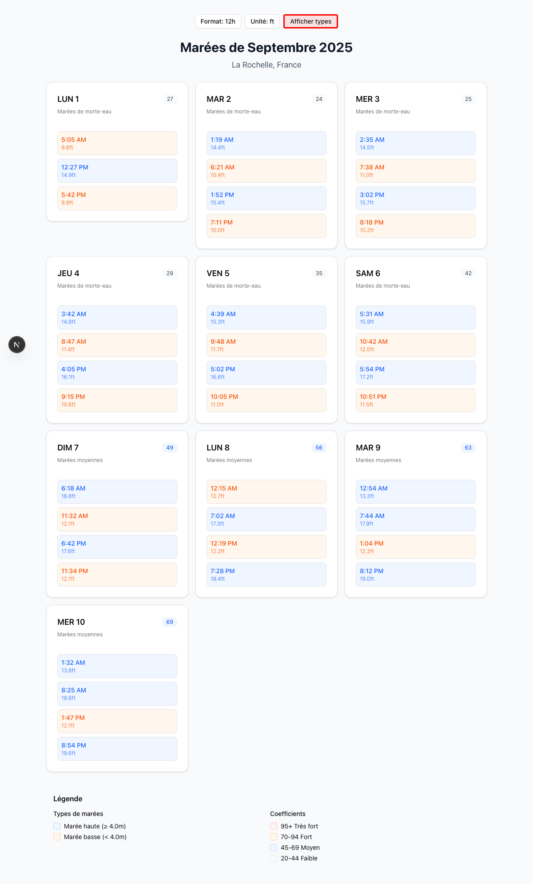
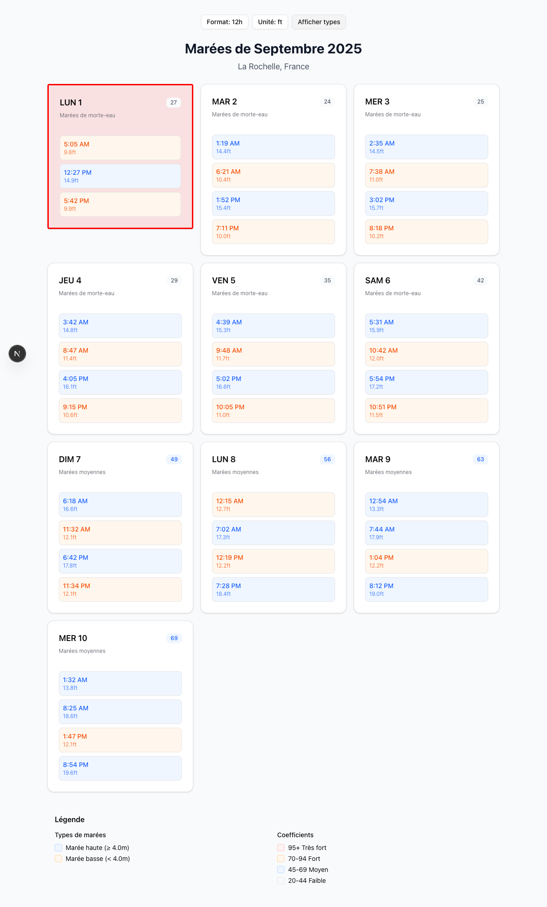
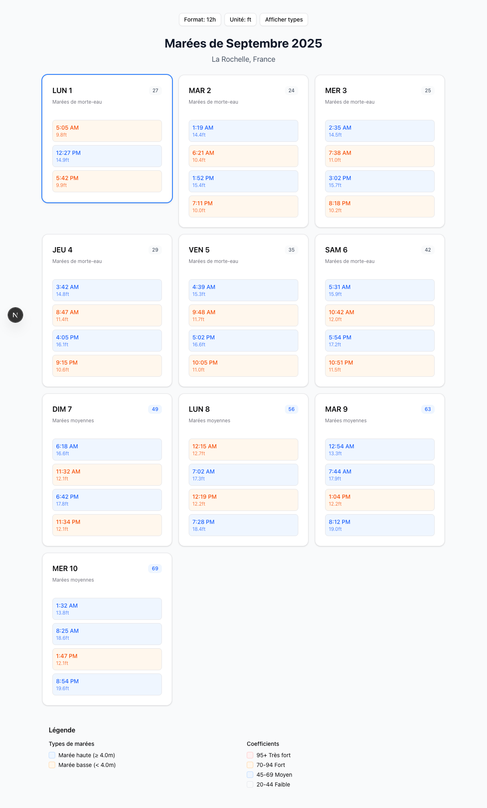

# Tide Viewer - User Guide

Welcome to the Tide Viewer application for La Rochelle, France! This comprehensive guide will walk you through all the features and functionality of the application.

## Overview

The Tide Viewer displays tide information for La Rochelle, showing daily tide schedules, coefficients, and detailed timing information. The application provides an intuitive interface with various customization options.

## Main Features

### 1. Application Header

The top of the application displays:
- **Title**: "Marées La Rochelle - Horaires et Coefficients" 
- **Location**: "La Rochelle, France"
- **Month and Year**: Currently showing "Marées de Septembre 2025"

### 2. Control Buttons

The application includes three control buttons at the top for customizing the display:

#### Time Format Toggle

The **Format** button (highlighted with red border above) allows you to switch between 24-hour and 12-hour time formats:

- **24h format**: Times displayed as "05:05", "12:27", "17:42"
- **12h format**: Times displayed as "5:05 AM", "12:27 PM", "5:42 PM"

Click the button to toggle between formats. When 12h format is active, the button shows "Format: 12h":

#### Measurement Unit Toggle

The **Unité** (Unit) button (highlighted with red border above) toggles between metric and imperial measurement units:

- **Meters (m)**: Default metric units - "2.99m", "4.53m"
- **Feet (ft)**: Imperial units - "9.8ft", "14.9ft"

When feet units are active, all measurements are converted and the button shows "Unité: ft":

#### Tide Type Display Toggle

The **Masquer types** (Hide types) button (highlighted with red border above) controls whether tide type labels are displayed:

- **Types shown**: Each tide time includes "Haute" (High) or "Basse" (Low) labels
- **Types hidden**: Only times and heights are shown, making the display more compact

When types are hidden, the button changes to "Afficher types" (Show types):

### 3. Daily Tide Cards

Each day is displayed as an interactive card containing:

#### Card Header
- **Day abbreviation and date**: "LUN 1" (Monday 1st)
- **Tide coefficient**: Large number indicating tide strength (e.g., "27")
- **Tide category**: "Marées de morte-eau" (Dead-water tides) or "Marées moyennes" (Average tides)

#### Tide Times and Heights
Each card shows up to 4 tide events for the day, displaying:
- **Time**: When the tide occurs
- **Height**: Water level in meters or feet
- **Type**: "Haute" (High tide) or "Basse" (Low tide) - when enabled

#### Interactive Selection

Tide day cards are clickable (highlighted with red border above). When you click on a day card:

1. The card becomes selected and highlighted
2. The selection is logged to the browser console
3. The card maintains an "active" state for visual feedback

### 4. Legend Section

At the bottom of the application, you'll find a comprehensive legend explaining:

#### Tide Types
- **Marée haute (≥ 4.0m)**: High tide events with water level 4.0 meters or higher
- **Marée basse (< 4.0m)**: Low tide events with water level below 4.0 meters

#### Tide Coefficients
The coefficient indicates the tide strength:
- **95+ Très fort**: Very strong tides (coefficient 95 and above)
- **70-94 Fort**: Strong tides (coefficient 70-94)
- **45-69 Moyen**: Medium tides (coefficient 45-69)
- **20-44 Faible**: Weak tides (coefficient 20-44)

## How to Use the Application

### Viewing Daily Tides
1. Scroll through the month view to see all available days
2. Each card shows the complete tide schedule for that day
3. Note the coefficient to understand tide strength
4. Use the tide category to understand the general tide pattern

### Customizing the Display
1. **Change time format**: Click the "Format" button to switch between 24h and 12h display
2. **Change units**: Click the "Unité" button to toggle between meters and feet
3. **Simplify display**: Click "Masquer types" to hide tide type labels for a cleaner view

### Selecting a Specific Day
1. Find the day you're interested in
2. Click on the day card to select it
3. The selected day will be highlighted and logged for further processing

## Understanding Tide Information

### Tide Patterns
- **Morte-eau** (Dead-water): Weaker tides with smaller differences between high and low water
- **Moyennes** (Average): Moderate tide strength
- **Vive-eau** (Spring tides): Stronger tides with larger differences (higher coefficients)

### Reading Tide Times
- Tides typically occur 2-4 times per day
- Times are shown in chronological order throughout the day
- Heights indicate the water level above chart datum

### Coefficient Significance
- Higher coefficients mean stronger tides
- Useful for planning activities like sailing, fishing, or beach visits
- Important for navigation and safety considerations

## Technical Notes

- The application is responsive and works on both desktop and mobile devices
- All interactions are immediate and don't require page refreshes
- Time formats respect your preference throughout the session
- Unit preferences are maintained while using the application

## Troubleshooting

If you encounter any issues:
1. Refresh the page to reload tide data
2. Check that your browser supports modern JavaScript features
3. Ensure you have a stable internet connection for the best experience

---

*This application provides tide information for La Rochelle, France. Always consult official maritime sources for navigation and safety-critical applications.*
